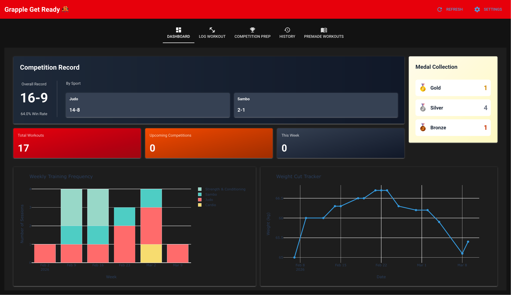
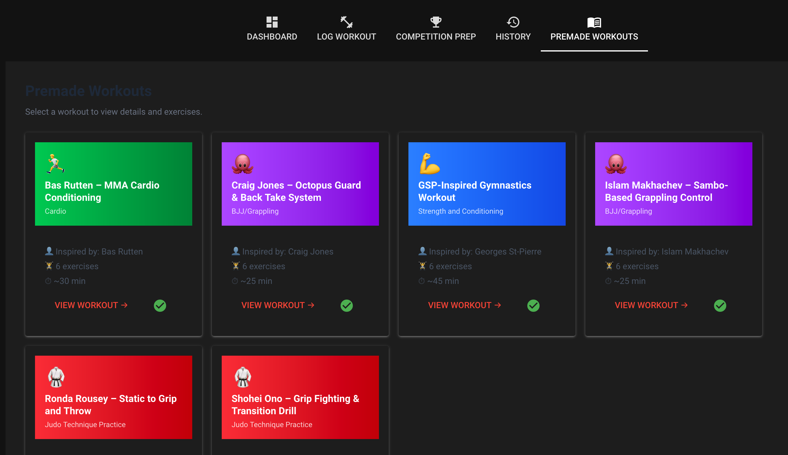

# 🤼‍♂️ Grapple Get Ready

> **Your all-in-one combat sports training companion** — track practices, monitor your weight cut, log competition results, and follow athlete-inspired workouts. Built for grapplers, by grapplers.



---

## What Is It?

Grapple Get Ready (GGR) is a local Python web app designed for competitive grapplers preparing for tournaments in **Judo, BJJ, Wrestling, Sambo, MMA**, and more. Whether you're cutting weight for a big tournament or just trying to stay consistent with mat time, GGR keeps everything in one place.

No subscriptions. No cloud. Just you and your training data.

---

## Features

### 📊 Dashboard
Get a bird's-eye view of your training at a glance:
- **Competition record** — overall W/L/D and broken down by sport
- **Medal collection** — Gold 🥇, Silver 🥈, Bronze 🥉 tracker
- **Weekly training frequency** — stacked bar chart by workout type
- **Weight cut tracker** — plot your weight over time against upcoming competition targets

### 💪 Log Workouts
Quickly record any training session:
- Workout type (Judo, Sambo, Wrestling, BJJ, MMA, S&C, Cardio, Drilling)
- Date, duration, intensity level
- Bodyweight at time of session
- Free-form notes (sparring partners, techniques drilled, rounds completed)

### 🏆 Competition Prep
Track both **single matches** and **multi-match tournaments**:
- Log weight class and current weight for cut planning
- Record results (Win / Loss / Draw / No Contest / Upcoming)
- Track medals for tournament placements
- Edit or delete entries as results come in

### 📖 Premade Workouts
No coach? No problem. Browse **athlete-inspired training sessions** pulled from JSON files in the `workouts/` directory:
- Full exercise breakdowns with sets, reps, equipment, and coaching cues
- Quick-log any premade session directly to your history with one click
- Add your own custom workout JSON files to expand the library

### 🗂️ Training History
Scroll through your last 20 sessions sorted by most recent — type, date, duration, intensity, weight, and notes all visible at a glance.

---

## Getting Started

### Requirements
- Python 3.9+
- uv

### Install dependencies

```bash
uv add nicegui plotly
```

### Run the app

```bash
uv run main.py
```

Then open [http://localhost:8080](http://localhost:8080) in your browser.

---

## Adding Premade Workouts

Drop `.json` files into the `workouts/` directory. Each file should follow this structure:

```json
{
  "workout": {
    "name": "Uchi Mata Fundamentals",
    "type": "Judo Technique Practice",
    "inspired_by": "Teddy Riner",
    "duration_minutes": 75,
    "notes": [
      "Focus on kuzushi before the throw",
      "Film yourself from the side"
    ],
    "exercises": [
      {
        "id": 1,
        "name": "Uchi Mata Entry Drill",
        "sets": 4,
        "reps_min": 10,
        "reps_max": 15,
        "equipment": "Partner or crash pad",
        "description": "Slow entry reps focusing on hip position.",
        "cue": "Drive your hip through, not around."
      }
    ]
  }
}
```

Supported workout types: `Judo Technique Practice`, `BJJ/Grappling`, `Strength and Conditioning`, `MMA`, `Cardio`

---

## Data Storage

All your workouts and competition data are saved locally to `combat_sports_data.json` in the project directory. Back it up before major OS changes or reinstalls.

---

## Contributing

GGR is open to contributions! Here are features that would make great additions:

- **Periodization planner** — plan training blocks that peak for a target competition date
- **Mobile-friendly layout** — better responsiveness for logging workouts from your phone
- **More premade workouts** — add JSON files for more sports or athlete-inspired sessions
- **Weight cut calculator** — estimate daily deficit needed to hit a target weight by comp day
- **Training analytics** — trends over time, personal records, intensity distribution
- **Export / backup tool** — one-click export of `combat_sports_data.json` with a timestamp

To contribute, fork the repo, make your changes, and open a pull request.


---

## Built With

- [NiceGUI](https://nicegui.io/) — Python-native UI framework
- [Plotly](https://plotly.com/python/) — Interactive charts

---

*Train smart. Cut clean. Compete ready.* 🥋
